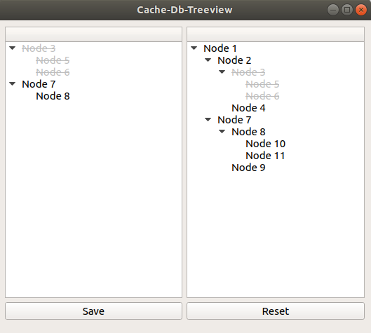

# Cached treeview
Cached treeview allows controlling of a large hierarchical database. Supports the following actions "upload to cache" then "rename node", "remove node", "add node".
After working with cache all changes can be saved in the original database.
# Build and run

```
git clone https://github.com/IovlevYuliy/qs-test-problem.git
cd qs-test-problem
mkdir build && cd build
cmake .. && make
./treeview
```
# User interface
The user interface contains two treeviews. The right treeview presents the original database and the left one is cache.


Use the right mouse button to open the context menu on both treeviews. Use mouse double click by a node for renaming nodes. Button "Save" saves all changes in the cache to database. Button "Reset" returns treeviews to the default states.
